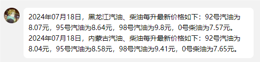

<div align="center">
  <a href="https://v2.nonebot.dev/store"></a>
  <br>
  <p></p>
</div>

<div align="center">

# nonebot_plugin_daily_oil_price

⛽今日油价⛽

<a href="./LICENSE">
    
</a>
<a href="https://pypi.python.org/pypi/nonebot-plugin-template">
    
</a>


</div>


## 📖 介绍

定时向指定群&好友发送  **当日油价**

数据源：[汽车之家](https://www.autohome.com.cn/oil)


- 推荐python`3.9+`

## 💿 安装

<details>
<summary>使用 nb-cli 安装</summary>
在 nonebot2 项目的根目录下打开命令行, 输入以下指令即可安装

    nb plugin install nonebot-plugin-daily-oil-price

</details>

<details>
<summary>使用包管理器安装</summary>
在 nonebot2 项目的插件目录下, 打开命令行, 根据你使用的包管理器, 输入相应的安装命令

    pip install nonebot-plugin-daily-oil-price


打开 nonebot2 项目根目录下的 `pyproject.toml` 文件, 在 `[tool.nonebot]` 部分追加写入

    plugins = ["nonebot-plugin-daily-oil-price"]

</details>


## ⚙️ 配置

在 nonebot2 项目的`.env`文件中添加下表中的必填配置

| 配置项 | 必填 | 默认值 |  说明 |
|:-----:|:----:|:----:|:----:|
| all_qq_groups | 否 | False | 开启全部群聊推送 |
| qq_groups | 否 | [ ] | 列表形式，如[123,456] |
| qq_friends | 否 | [ ] | 列表形式，如[123,456] |
| provinces | 否 | [ ] | 列表形式，如["北京","上海"] |
| send_time | 否 | 8 00 | 每日推送时间，以空格隔开 |

通过群聊/私聊添加的自定义配置优先于`.env`配置

配置示例如下


```
all_qq_groups=False #开启全部群聊推送
qq_groups=[123,456] #设定要发送的QQ好友
qq_friends=[123,456] #设定要发送的群
provinces=["北京","上海"] #设定默认油价省份
history_inform_time="8 00" #设定每天发送时间，以空格间隔
```


## 🎉 使用
### 指令表
| 指令  | 说明 |
|:-----:|:----:|
| 今日油价+省份 | 获取今日该省的油价 |
| 油价推送+状态 | 查看油价推送时间和推送省份|
| 油价推送+取消 |取消当前推送指令|
| 油价推送+设置 | 连续对话进行推送时间和省份设置 |

### 🖼️效果图

